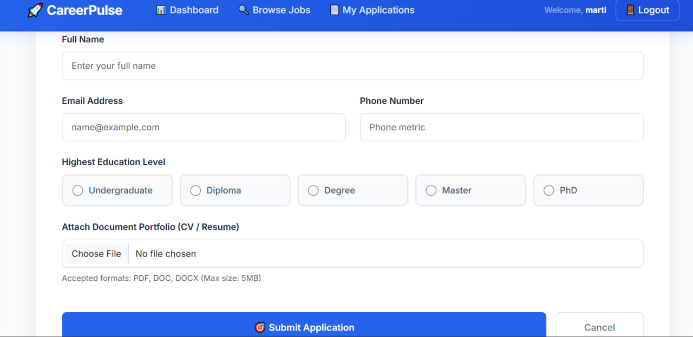

# Job Portal System

A web-based platform designed to connect job seekers with employers and streamline job applications, candidate tracking, and account management.

## 📋 Overview

The **Job Portal System** bridges the gap between job seekers and employers. It allows employers to post job vacancies, manage applications, and helps job seekers discover opportunities and submit their resumes online — all in one place.

---
## 🚀 Key Features

### For Job Seekers
- ✅ Create and manage your professional profile
- 🔍 Browse and filter job listings by title, category, or location
- 📄 Apply directly and Submit applications with your resume
- 📊 Track application status (Submitted → Reviewed → Accepted/Rejected)

### For Employers
- 📝 Create, update, or deactivate job postings
- 👥 Review applicant profiles and resumes
- 📌 Manage/Update candidate application statuses
- mark the candidate as 'Accepted' / 'Rejected'

### For Administrators
- 👑 Manage users (job seekers and employers)
- 🛡️ Monitor job listings for compliance

## 🛠️ Technology Stack

* **Front-End:** HTML5, CSS3, Bootstrap 5, JavaScript
* **Back-End:** C#, ASP.NET Core MVC
* **Database:** SQL Server Management Studio (SSMS)
* **IDE & Tools:** Visual Studio 2022, Git, GitHub

---
## 🔧 Setup & Installation

### Prerequisites
- Visual Studio 2022 or later
- SQL Server (SSMS)
- .NET Core SDK

### Step-by-Step Guide

1. **Clone the repository**
   ```bash
   git clone https://github.com/Mahi-Nyx/JobPortalSystem.git
   ```

2. **Open** `JobPortalSystem.sln` in Visual Studio

3. **Update connection string** in `appsettings.json`:
   ```json
   "ConnectionStrings": {
     "DefaultConnection": "Server=YOUR_SERVER;Database=JobPortalDb;Trusted_Connection=True;"
   }
   ```

4. **Run migrations** in Package Manager Console:
   ```bash
   Update-Database
   ```

5. **Run** with `F5` or click IIS Express

System Preview 📸 Screenshots 


### Home Page


### Login Page


### Jobseeker Dashboard


### Jobseeker Apply


🤝 Contributing
This is a personal portfolio project, but feedback and suggestions are always welcome! Feel free to open an issue or reach out.

👨‍💻 Author
Mahi-Nyx
GitHub: github.com/Mahi-Nyx

