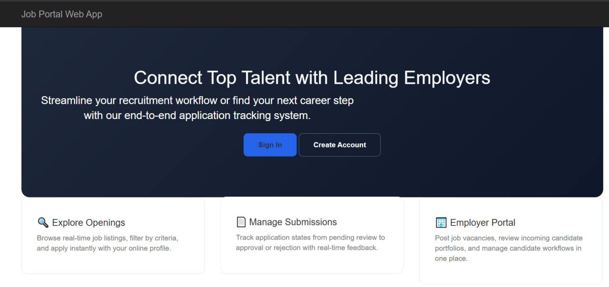
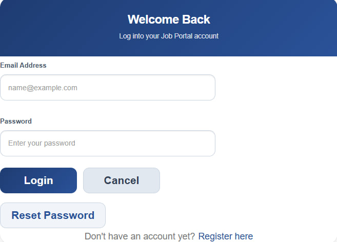
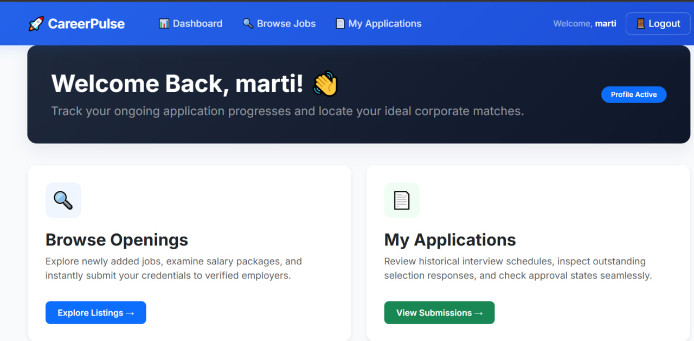
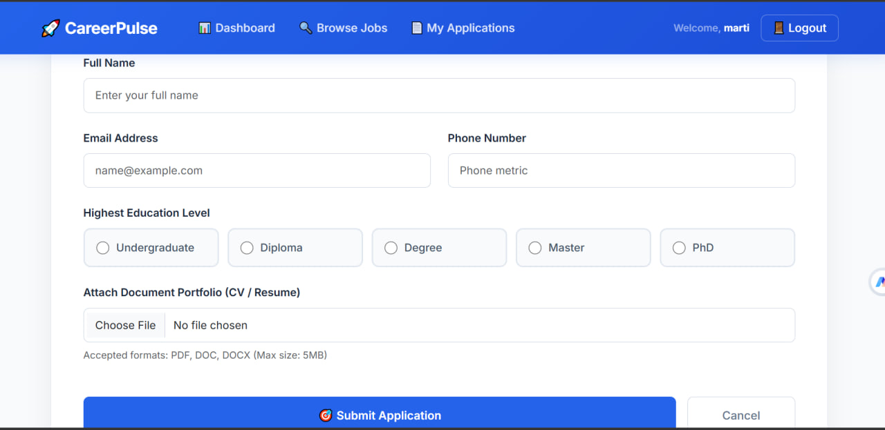

# Job Portal System

A web-based platform designed to connect job seekers with employers and streamline job applications, candidate tracking, and account management.

---

## 📌 Features

* **Job Seekers:** Browse available job postings, search positions, apply directly, and manage user accounts.
* **Employers:** Post new job openings, manage candidate applications, and track applicants.
* **Admin:** Oversee system users, manage roles, and monitor portal activity.

---

## 🛠️ Technology Stack

* **Front-End:** HTML5, CSS3, Bootstrap 5, JavaScript
* **Back-End:** C#, ASP.NET Core MVC
* **Database:** SQL Server Management Studio (SSMS)
* **IDE & Tools:** Visual Studio 2022, Git, GitHub

---

System Preview 📸 Screenshots 


### Home Page


### Login Page


###Jobseeker Dashboard


### Applay


## 🚀 How to Run locally

1. Clone this repository:
   ```bash
 [  git clone[ [https://github.com/Mahi-Nyx/JobPortalSystem.git](https://github.com/Mahi-Nyx/JobPortalSystem.git)](https://github.com/Mahi-Nyx/JobPortalSystem)](https://github.com/Mahi-Nyx/JobPortalSystem)
